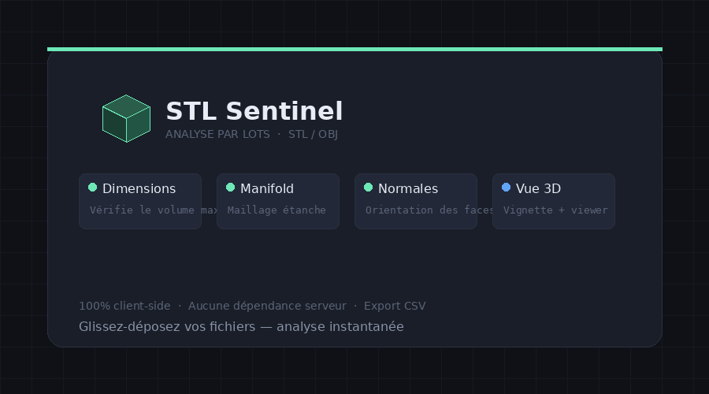

<p align="center">
  
</p>

<h1 align="center">STL Sentinel</h1>

<p align="center">
  <strong>Analyseur de fichiers STL / OBJ par lots pour l'impression 3D</strong><br>
  Application web légère, 100% côté client, sans serveur — prête à déployer.
</p>

<p align="center">
  
  
  
  
</p>

<p align="center">
  
</p>

---

## Fonctionnalités

- **Import par lots** — Glissez-déposez vos fichiers STL (binaires ou ASCII) et OBJ. L'analyse se lance automatiquement.
- **Volume d'impression** — Renseignez les dimensions X × Y × Z de votre plateau. L'application vérifie si chaque objet rentre dans ce volume, quelle que soit son orientation.
- **Prévisualisation 3D** — Vignette pour chaque fichier dans la liste + viewer 3D interactif (rotation à la souris, zoom molette) à l'ouverture des détails.
- **Rapport d'analyse** — Score par fichier avec le détail des corrections nécessaires.
- **Export CSV** — Téléchargez un récapitulatif complet de tous les fichiers analysés.

---

## Déploiement

Aucun build, aucune dépendance serveur, aucun `npm install`. Copiez les fichiers sur n'importe quel hébergement web.

```bash
# Cloner le dépôt
git clone https://github.com/VOTRE-UTILISATEUR/stl-sentinel.git

# C'est tout — ouvrez index.html ou déployez sur votre serveur
```

### Hébergement local rapide

```bash
cd stl-sentinel
python3 -m http.server 8080
# → http://localhost:8080
```

---

## Arborescence

```
stl-sentinel/
├── index.html                  Page principale
├── site.webmanifest            Manifeste PWA
├── LICENSE
├── css/
│   └── style.css               Styles (thème sombre)
├── js/
│   ├── stl-parser.js           Parseur STL + OBJ
│   ├── analyzers.js            Modules d'analyse (extensibles)
│   └── app.js                  Logique UI, rendu 3D, orchestration
└── assets/
    ├── favicon.svg             Icône vectorielle
    ├── favicon.ico             Multi-tailles (16→256)
    ├── favicon-*.png           PNG de 16×16 à 512×512
    ├── apple-touch-icon.png    180×180 pour iOS
    └── android-chrome-*.png    192 et 512 pour Android
```

---

## Ajouter un critère d'analyse

L'architecture est modulaire. Pour ajouter un nouveau critère, ajoutez un bloc dans `js/analyzers.js` :

```javascript
STLAnalyzers.register({
    id: 'monCritere',
    label: 'Mon critère',
    description: 'Ce que ça vérifie',
    defaultPoints: 3,
    analyze(mesh, settings) {
        // mesh.triangles, mesh.bbox, mesh.volume, mesh.surfaceArea
        // settings.maxX / maxY / maxZ

        const ok = /* votre logique */;

        return {
            pass: ok,
            message: ok ? 'Tout est bon' : 'Problème détecté',
            severity: ok ? 'success' : 'error'  // ou 'warning'
        };
    }
});
```

Le critère apparaîtra automatiquement dans les résultats et l'export CSV.

---

## Dépendances externes

| Librairie | Usage | Chargée via |
|---|---|---|
| [Three.js](https://threejs.org/) r128 | Vignettes et viewer 3D | CDN (cdnjs) |
| [DM Sans](https://fonts.google.com/specimen/DM+Sans) | Typographie interface | Google Fonts |
| [Space Mono](https://fonts.google.com/specimen/Space+Mono) | Typographie monospace | Google Fonts |

Aucune dépendance côté serveur. Tout tourne dans le navigateur.

---

## Compatibilité

- Chrome / Edge 90+
- Firefox 90+
- Safari 15+
- Mobile (responsive + contrôles tactiles sur le viewer 3D)

---

## Soutenir le projet

Si cette application vous est utile, vous pouvez soutenir mon travail :

**[☕ fr.tipeee.com/maxtechno](https://fr.tipeee.com/maxtechno/)**

---

## Licence

MIT — Utilisez, modifiez, distribuez librement.
